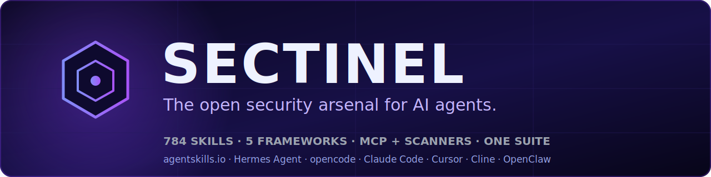

<div align="center">



<br/><br/>

[](LICENSE)
[](https://agentskills.io)
[](#qué-incluye)
[](#cinco-marcos-un-arsenal)
[](#cinco-marcos-un-arsenal)

### El arsenal de seguridad abierto para agentes de IA. 784 habilidades, integración con MCP e integraciones de escáneres en una sola suite instalable.

**🌐 [English](README.md) · Español · [中文](README.zh.md) · [Français](README.fr.md) · [Deutsch](README.de.md) · [Português](README.pt.md) · [日本語](README.ja.md)**

</div>

---

## Por qué existe

Los agentes de IA pueden escribir código y buscar en la web, pero no vienen con las
guías prácticas en las que realmente se apoya un analista de seguridad. Qué complemento
de Volatility3 ejecutar contra un volcado de memoria. Qué regla Sigma detecta el
Kerberoasting. Cómo rastrear una entrada del usuario hasta un *sink* peligroso. Las pocas
bibliotecas de habilidades buenas que sí cubren esto están dispersas en distintos
repositorios, formatos y marcos.

Sectinel las reúne en un solo lugar. Empaqueta las bibliotecas de habilidades de
seguridad abiertas más sólidas, integra los principales escáneres abiertos y un MCP de
seguridad, asigna todo a cinco marcos de la industria y entrega el conjunto completo tras
un único instalador. Cualquier agente compatible con agentskills.io obtiene todo ello sin
nada que ensamblar.

## Qué incluye

**784 habilidades** procedentes de tres bibliotecas *upstream* (incorporadas bajo sus
licencias originales, con [atribución](#créditos-y-atribuciones) completa), además de la
integración de escáneres y MCP:

| Biblioteca | Habilidades | Cobertura |
|---|---:|---|
| **Anthropic-Cybersecurity-Skills** (@mukul975) | 754 | 26 dominios: nube, caza de amenazas, inteligencia de amenazas, web/apps, red, malware, DFIR, SecOps, IAM, SOC, contenedores, OT/ICS, API, gestión de vulnerabilidades, respuesta a incidentes, red team, pentest, endpoints, DevSecOps, phishing, criptografía, zero-trust, móvil, ransomware, cumplimiento, engaño |
| **cybersecurity-skills** (@briiirussell) | 29 | 7 familias: AppSec y cadena de suministro, ofensiva/reconocimiento, detección y respuesta, nube e infraestructura, seguridad de IA, diseño y gobernanza, cumplimiento y privacidad |
| **claude-cybersecurity** (@AgriciDaniel) | 1 (8 agentes) | orquestador insignia que se despliega en 8 especialistas en paralelo: detección de vulnerabilidades, autorización, secretos, cadena de suministro, IaC, inteligencia de amenazas, patrones de código de IA, lógica de negocio |

Explora el catálogo completo en [`docs/arsenal.md`](docs/arsenal.md) o en
[`arsenal/`](arsenal/).

### Anatomía de una habilidad (estándar agentskills.io)

Cada habilidad es una carpeta con un `SKILL.md`: *front-matter* YAML para un
descubrimiento rápido más un flujo de trabajo en Markdown estructurado, a menudo junto
con `references/`, `scripts/` y `assets/`. Un agente lee el *front-matter* (unos 30 tokens
cada uno) y carga solo la guía que necesita (de 500 a 2000 tokens), así obtienes cobertura
completa sin llenar la ventana de contexto.

## Cinco marcos, un arsenal

Las habilidades incluyen asignaciones a los principales marcos de la industria, de modo
que una sola guía puede responder a varias perspectivas de cumplimiento a la vez:

| Marco | Alcance |
|---|---|
| [MITRE ATT&CK](https://attack.mitre.org) | comportamientos del adversario / TTP (14 tácticas) |
| [NIST CSF 2.0](https://www.nist.gov/cyberframework) | postura organizativa (6 funciones) |
| [MITRE D3FEND](https://d3fend.mitre.org) | contramedidas defensivas |
| [MITRE ATLAS](https://atlas.mitre.org) | amenazas adversarias de IA/ML |
| [NIST AI RMF](https://airc.nist.gov/AI_RMF) | gestión de riesgos de IA |

## Compatibilidad

Sectinel se basa en el estándar abierto **[agentskills.io](https://agentskills.io)**, así
que se integra en cualquier *runtime* de agente compatible sin conversión:

| Runtime | Estado |
|---|---|
| **Hermes Agent** (NousResearch) | ✅ las habilidades agentskills.io se cargan de forma nativa |
| **OpenClaw** | ✅ lee el arsenal agentskills.io directamente |
| **opencode** | ✅ de primera clase (el instalador configura `~/.config/opencode`) |
| **Claude Code** | ✅ de primera clase (`~/.claude/skills`) |
| **Cursor · Cline · Windsurf · Roo Code · Continue · Aider** | ✅ mediante el estándar y [`adapters/`](adapters/) |
| **OpenAI Codex CLI · Gemini CLI** | ✅ mediante el estándar y [`adapters/`](adapters/) |

Consulta [`adapters/README.md`](adapters/README.md) para los pasos de instalación por
plataforma.

## Instalación

```bash
# Clona y luego instala el arsenal (habilidades + insignia + integración de escáneres/MCP)
git clone https://github.com/Mikaru0Mystic/sectinel.git
cd sectinel
bash scripts/install.sh        # macOS / Linux / WSL
#  o, en Windows:  pwsh scripts/install.ps1
```

Esto instala el arsenal de 784 habilidades en `~/.config/opencode/cybersec-arsenal/`, la
habilidad insignia `cybersecurity` en `~/.claude/skills/`, e imprime el fragmento de
configuración del MCP de seguridad. Reinicia tu *runtime* de agente después.

## Escáneres y motores integrados

Las habilidades de Sectinel saben cómo manejar herramientas reales. Estas se ejecutan en
tiempo de ejecución en lugar de incluirse, y cada una conserva su propia licencia
(consulta [Atribuciones](#créditos-y-atribuciones)):

| Herramienta | Función | ¿Incluida? |
|---|---|---|
| **[ship-safe](https://github.com/asamassekou10/ship-safe)** | escáner defensivo de 23 agentes (sin clave API) | invocada (`npx`) |
| **[Shannon](https://github.com/KeygraphHQ/shannon)** | pentester de IA autónomo de caja blanca | invocada (AGPL, no incluida) |
| **[PentAGI](https://github.com/vxcontrol/pentagi)** | plataforma de pentest autónoma (nmap/metasploit/sqlmap) | invocada (no incluida) |
| **Semgrep / OSV-Scanner / Trivy / Gitleaks / Checkov / hadolint** | SAST / SCA / IaC / secretos | invocadas |
| **Semgrep MCP** | SAST sobre el Model Context Protocol | configuración en [`mcp/`](mcp/) |

Consulta [`docs/integrations.md`](docs/integrations.md) y [`mcp/README.md`](mcp/README.md).

## Combinar con Breachproof (opcional)

Sectinel es el arsenal y se sostiene por sí solo con cualquier agente compatible con
agentskills.io. Si quieres un operador autónomo que lo maneje,
**[Breachproof](https://github.com/Mikaru0Mystic/breachproof)** es un agente autónomo
construido en torno a esta biblioteca: toma las habilidades, ejecuta los escáneres y lleva
una base de código a cero hallazgos. Totalmente opcional; Sectinel no necesita nada más
para ser útil.

## Actualizar el arsenal

Las bibliotecas están incorporadas (*vendored*) para que la instalación siga siendo
autónoma. Puedes actualizarlas desde *upstream* cuando quieras:

```bash
bash scripts/sync-arsenal.sh
```

## Contribuir

Las contribuciones más útiles son los comentarios de campo y nuevas habilidades. Una
habilidad nueva debe seguir el formato `SKILL.md` de agentskills.io e incluir asignaciones
a marcos (la CI verifica `name` y `description`). Consulta [CONTRIBUTING.md](CONTRIBUTING.md)
y el [Código de conducta](CODE_OF_CONDUCT.md).

> Si estás corrigiendo una habilidad *upstream* incorporada, envía también la corrección
> al proyecto original (enlazado abajo) para que todos se beneficien, no solo esta copia.

## Licencia

La [Licencia Apache 2.0](LICENSE) cubre el código y el empaquetado propios de Sectinel.
Las bibliotecas incorporadas conservan sus licencias **originales** (Apache-2.0 y MIT).
Consulta el archivo `LICENSE` de cada biblioteca en [`arsenal/`](arsenal/), junto con
[NOTICE](NOTICE) y [ATTRIBUTIONS.md](ATTRIBUTIONS.md).

## Créditos y atribuciones

Sectinel es, en realidad, un proyecto de curación e integración. No existiría sin las
personas que escribieron las bibliotecas y herramientas que reúne. Cada una es su trabajo,
usado bajo su propia licencia:

### Bibliotecas de habilidades incorporadas (en `arsenal/`, con sus archivos LICENSE)
- **[Anthropic-Cybersecurity-Skills](https://github.com/mukul975/Anthropic-Cybersecurity-Skills)**, 754 habilidades, por **Mahipal Jangra (@mukul975)**. Apache-2.0.
- **[cybersecurity-skills](https://github.com/briiirussell/cybersecurity-skills)**, 29 habilidades, por **Bri Russell (@briiirussell)**. MIT.
- **[claude-cybersecurity](https://github.com/AgriciDaniel/claude-cybersecurity)**, habilidad insignia de 8 agentes, por **@AgriciDaniel**. MIT.

### Herramientas integradas (invocadas, no incluidas)
- **[ship-safe](https://github.com/asamassekou10/ship-safe)** por @asamassekou10. MIT.
- **[Shannon](https://github.com/KeygraphHQ/shannon)** por Keygraph. AGPL-3.0.
- **[PentAGI](https://github.com/vxcontrol/pentagi)** por vxcontrol. Apache-2.0 / EULA.
- **[Semgrep](https://semgrep.dev)**, **[OSV-Scanner](https://github.com/google/osv-scanner)**, **[Trivy](https://github.com/aquasecurity/trivy)**, **[Gitleaks](https://github.com/gitleaks/gitleaks)**, **[Trufflehog](https://github.com/trufflesecurity/trufflehog)**, **[Checkov](https://github.com/bridgecrewio/checkov)**, **[hadolint](https://github.com/hadolint/hadolint)**.

### Estándares y marcos
[agentskills.io](https://agentskills.io) · [MITRE ATT&CK](https://attack.mitre.org) · [MITRE D3FEND](https://d3fend.mitre.org) · [MITRE ATLAS](https://atlas.mitre.org) · [NIST CSF 2.0](https://www.nist.gov/cyberframework) · [NIST AI RMF](https://airc.nist.gov/AI_RMF).

«Anthropic» y «Claude» son marcas de Anthropic PBC. Todos los demás nombres y marcas
pertenecen a sus respectivos propietarios. Sectinel es un proyecto independiente, **no
afiliado, patrocinado ni respaldado** por ninguno de los anteriores. Se ofrece
**únicamente para uso de seguridad defensiva autorizado**.
